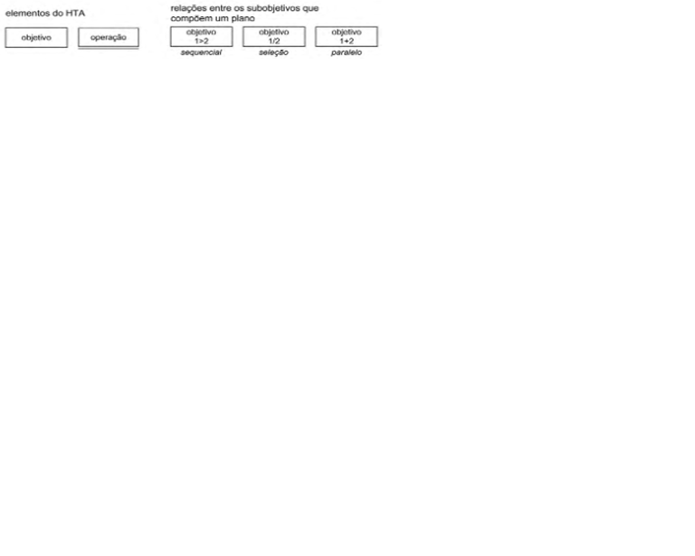

# Analise de Tarefas

## 1. Introdução

A principal utilidade da análise de tarefas é ter um entendimento sobre qual é o trabalho dos usuários, como eles o realizam e por quê. As diretrizes da análise de tarefas é baseada nos objetivos que os usuários querem ou precisam atingir dentro da aplicação. Com isso, a questão passa a ser como se deveria definir um “desempenho satisfatório” para o sistema. Trata-se então de não apenas listar ações necessárias para executar uma tarefa, mas entender como um sistema afeta o domínio da aplicação, e como o domínio de aplicação afeta o sistema de trabalho.

Dentro da Interação Humano Computador, a análise de tarefas pode ser utilizada nas três atividades mais habituais: para análise da situação atual, para o (re) design de um sistema computacional ou para a avaliação do resultado de uma intervenção que inclua a introdução de um (novo) sistema computacional. O primeiro passo, ou um dos primeiros, passa então a ser coletar um conjunto de objetivos. Para cada um desses objetivos são elaboradas ações realizadas por algum agente para alcançar esse determinado objetivo. 

Para a análise de tarefas do nosso projeto será utilizado o método de Análise Hierárquica de tarefas que será apresentado logo abaixo.

## 2. Analise Hierárquica de tarefas

A Análise Hierárquica de Tarefas é um método que foi desenvolvido para entender as competências e habilidades exibidas em tarefas mais complexas e não repetitivas. Ela ajuda a entender o que as pessoas irão fazer ou fazem, por que o fazem, e quais as consequências casos não façam corretamente.

Uma tarefa é alguma parte do trabalho que precisa ser desenvolvida e realizada, sempre podendo ser definida em termos dos seus objetivos. Como dito anteriormente, as análises de tarefas normalmente é coletar um conjunto de objetivos, antes de se considerar as ações através das quais as ações podem ser realizas. Segundo o livro ...: “ Objetivo é um estado específico de coisas, um estado final. Esse estado pode ser definido por um ou mais eventos ou por valores fisicamente observáveis de uma ou mais variáveis, que atuam como critério de alcance do objetivo e, em última instância, do desempenho do sistema”.

A Analise Hierárquica de tarefas analisa primordialmente os objetivos, decompondo-os em subobjetivos, buscando identificar quais desses são mais difíceis de atingir. No nível mais baixo da hierarquia de objetivos, cada subobjetivo é definido por uma operação, que é a unidade fundamental da Analise Hierárquica de tarefas. Abaixo é demostrado os elementos de um diagrama HTA.
  

