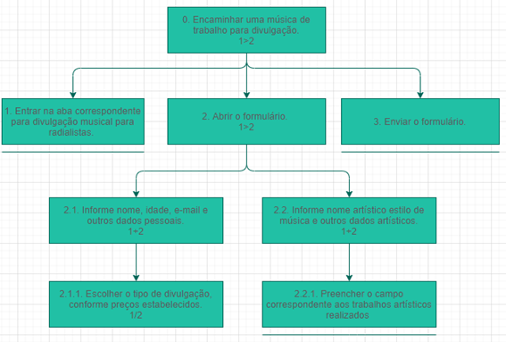
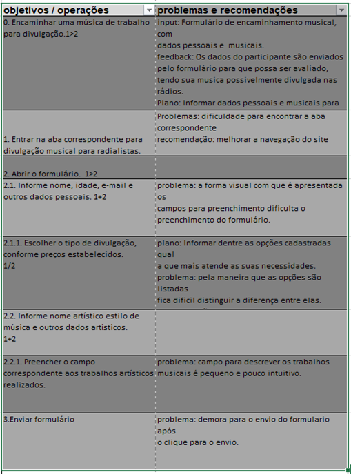
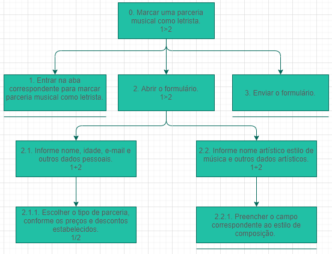
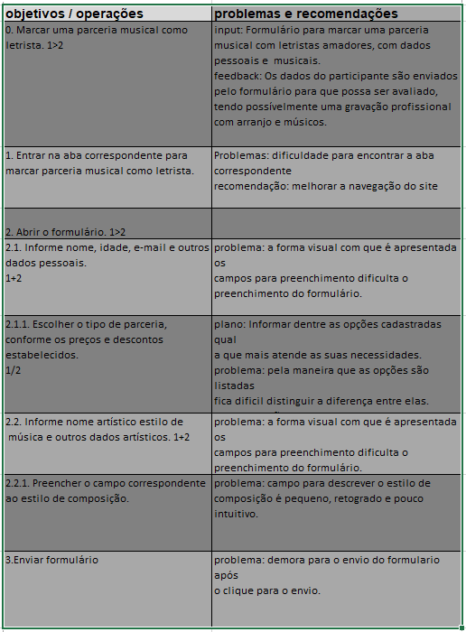
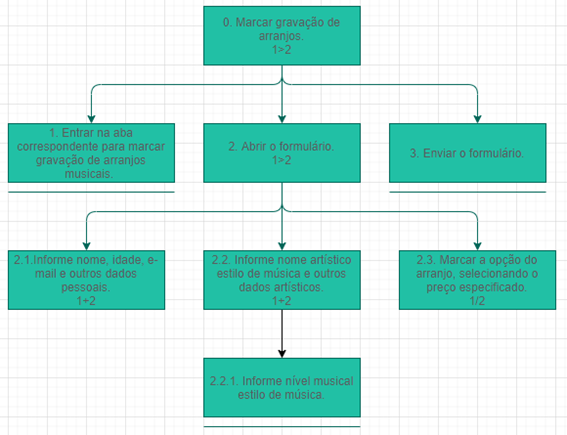
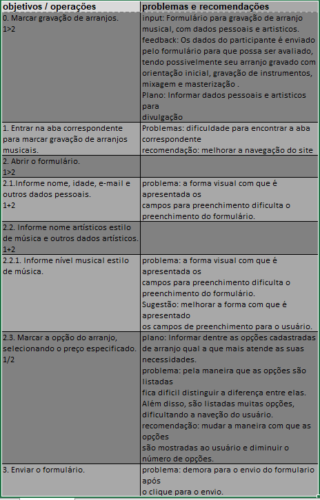

# Analise de Tarefas

## 1. Introdução

A principal utilidade da análise de tarefas é ter um entendimento sobre qual é o trabalho dos usuários, como eles o realizam e por quê. As diretrizes da análise de tarefas é baseada nos objetivos que os usuários querem ou precisam atingir dentro da aplicação. Com isso, a questão passa a ser como se deveria definir um “desempenho satisfatório” para o sistema. Trata-se então de não apenas listar ações necessárias para executar uma tarefa, mas entender como um sistema afeta o domínio da aplicação, e como o domínio de aplicação afeta o sistema de trabalho.

Dentro da Interação Humano Computador, a análise de tarefas pode ser utilizada nas três atividades mais habituais: para análise da situação atual, para o (re) design de um sistema computacional ou para a avaliação do resultado de uma intervenção que inclua a introdução de um (novo) sistema computacional. O primeiro passo, ou um dos primeiros, passa então a ser coletar um conjunto de objetivos. Para cada um desses objetivos são elaboradas ações realizadas por algum agente para alcançar esse determinado objetivo. 

Para a análise de tarefas do nosso projeto será utilizado o método de Análise Hierárquica de tarefas para os objetivos relacionados ao preenchimento de formulários e o metodo CMN-GOMS para os outros objetivos.

## 2. Analise Hierárquica de tarefas

A Análise Hierárquica de Tarefas é um método que foi desenvolvido para entender as competências e habilidades exibidas em tarefas mais complexas e não repetitivas. Ela ajuda a entender o que as pessoas irão fazer ou fazem, por que o fazem, e quais as consequências casos não façam corretamente.

Uma tarefa é alguma parte do trabalho que precisa ser desenvolvida e realizada, sempre podendo ser definida em termos dos seus objetivos. Como dito anteriormente, as análises de tarefas normalmente é coletar um conjunto de objetivos, antes de se considerar as ações através das quais as ações podem ser realizas. Segundo o livro Interação Humano Computador(Barbosa e Silva, 2010): “ Objetivo é um estado específico de coisas, um estado final. Esse estado pode ser definido por um ou mais eventos ou por valores fisicamente observáveis de uma ou mais variáveis, que atuam como critério de alcance do objetivo e, em última instância, do desempenho do sistema”.

A Analise Hierárquica de tarefas analisa primordialmente os objetivos, decompondo-os em subobjetivos, buscando identificar quais desses são mais difíceis de atingir. No nível mais baixo da hierarquia de objetivos, cada subobjetivo é definido por uma operação, que é a unidade fundamental da Analise Hierárquica de tarefas. Abaixo é demostrado os elementos de um diagrama HTA.

*Figura 1 -  Elementos diagrama HTA, BARBOSA, Simone et al. "Interação Humano-Computador". 2010. p. 193.*

Abaixo é apresentado um diagrama HTA feito a partir do objetivo de “Marcar uma auto divulgação de artista” no site MusikCity.

*Figura 2 -  Diagrama HTA para "marcar uma divulgação de artista", site MusikCity.*

Com base nesse diagrama HTA é possível ilustrar essa representação em forma de tabela. Dentro da tabela são especificados itens como: ação, plano, input e o feedback. Um plano define os subobjetivos necessários para alcançar um outro objetivo maior, e a ordem em que esses subobjetivos devem ser alcançados. Uma ação pode ser entendida como uma instrução para fazer algo sob certas circunstâncias, o input como estados e o feedback como testes ou avaliação do estado final. Além disso, podem ser apresentados problemas encontrados e recomendações.

  

*Figura 3 -  Tabela do diagrama HTA para "marcar uma divulgação de artista", site MusikCity.*

Abaixo são mostradas outras análises de tarefas realizadas no site MusikCity com suas respectivas tabelas.

*Figura 4 -  Diagrama HTA para "Divulgar música", site MusikCity.*

*Figura 5 -  Tabela do diagrama HTA para "Divulgar música", site MusikCity.*

*Figura 6 -  Diagrama HTA para "Marcar parceria como letrista", site MusikCity.*

*Figura 7 -  Tabela do diagrama para "Marcar parceria como letrista", site MusikCity.*

*Figura 8 -  Diagrama HTA para "Marcar Gravação de arranjo", site MusikCity.*

*Figura 9 -  Tabela do diagrama HTA para "Marcar Gravação de arranjo", site MusikCity*

Ao final do processo foi possível percerber muitos problemas em comum em vários desses objetivos, tendo assim um norte do trabalho que o usuário poderá ter para a realiazação
dos seus objetivos.

  

## 2. GOMS

GOMS é um conjunto de modelos utilizado para analisar o desempenho de usuários competentes de sistemas computacionais, realizando tarefas dentro da sua competência e sem cometer erros. Muitos sistemas são projetados considerando que as pessoas se tornam habilidosas no seu uso e, portanto, vão querer formas eficientes de realizar tarefas rotineiras. Os modelos GOMS têm se mostrado úteis para prever o desempenho, ou seja, predizer o impacto de decisões de design no desempenho competente.

 

O GOMS é um método para descrever uma tarefa e o conhecimento do usuário sobre como realizá-la em termos de objetivos (goals), operadores (operators), métodos (methods) e regras de seleção (selection rules). Os objetivos representam o que o usuário quer realizar utilizando o software (e.g., editar um texto). Os operadores são primitivas internas (cognitivas) ou externas (as ações concretas que o software permite que os usuários façam). Os métodos são sequências bem conhecidas de sub objetivos e operadores que permitem atingir um objetivo maior. Quando há mais do que um método para atingir um mesmo objetivo, são necessárias regras de seleção, que representam tomadas de decisão dos usuários sobre qual método utilizar numa determinada situação. 

 

### Realização do método

O método foi utilizado para os objetivos do usuário que diferem dos objetivos relacionados a preenchimento de formulários. Será utilizado o CMN-GOMS com um modelo sem detalhes, que tem a primitiva a proposta original do GOMS. O resultado obtido será apresentado abaixo.

- GOAL 0: Ouvir uma rádio ao-vivo.
	- GOAL 1: Entrar na aba correspondente.
		- METHOD 1.A: Navegar procurando no menu inicial a aba de rádios-  ao-vivo.
		- METHOD 1.B: Clicar sobre a respectiva aba.
	- GOAL 2: Encontrar a sua rádio de preferência para ouvir.
		- METHOD 2.A: Selecionar a rádio que deseja ouvir.
			- (SEL. RULE: O usuário está à procura de uma rádio específica e já sabe onde encontra-la).
		- METHOD 2.B: Navegar entre as seções de rádio pré-definidas, procurando uma rádio.
			- (SEL. RULE: O usuário está à procura de uma rádio para escutar, no entanto não tem uma opção previa).
	- GOAL 3: Ouvir a rádio selecionada.
		- METHOD 3: Clicar sobre o player da rádio que é aberto em uma nova aba.

- GOAL 0: Assistir um canal de Televisão ao-vivo.
	- GOAL 1: Entrar na aba correspondente.
		- METHOD 1.A: Navegar procurando no menu inicial a aba de TVs-  ao-vivo.
			- (SEL. RULE: No menu da página home serão apresentadas algumas das funcionalidades do site, uma delas é a de parada TV ao-vivo).
		- METHOD 1.B: Clicar sobre a respectiva aba.
	- GOAL 2: Encontrar o canal de Televisão que deseja assistir.
		- METHOD 2.A: Selecionar o canal que deseja assistir.)
			- (SEL. RULE: O usuário está à procura de um canal específico e já sabe onde encontra-lo).
		- METHOD 2.B: Navegar entre a lisa de canais de Televisão ao-vivo até encontrar um canal que seja agradável.
			- (SEL. RULE: O usuário está à procura de um canal de Televisão para assistir, no entanto não tem uma opção previa).
		- METHOD 2.C: Clicar sobre a opção escolhida.
	- GOAL 3: Assistir o canal selecionado.
		- METHOD 3.A: Clicar no respectivo link que redirecionará para a página do canal.
			- (SEL. RULE: Será apresentado ao usuário a descrição sobre o respectivo canal, além do link para poder assistir. O usuário deverá clicar nesse link).
		- METHOD 3.B: Clicar para executar o player na página que é aberta.

 
- GOAL 0: Ver a lista de top 50 músicas 
	- GOAL 1: Entrar na aba correspondente
		- METHOD 1.A: Navegar procurando no menu inicial a aba de parada TOP 50.
			- (SEL. RULE: No menu da página home serão apresentadas algumas das funcionalidades do site, uma delas é a de parada TOP 50).
		- METHOD 1.B: Clicar sobre a respectiva aba.
	- GOAL 2: Visualizar a lista de parada de sucessos top 50 musikcity.
		- METHOD 2: Navegar pela página, rolando o scroll, para acompanhar a lista.
	- GOAL 3: Escutar a música/assistir o vídeo clipe.
		- METHOD 3.A: Percorrer o site para selecionar a música desejada.
			- (SEL. RULE: O usuário percorreu a lista de top 50 e encontrou uma música que deseja ouvir).
		- METHOD 3.B: Clicar em uma música que foi do seu agrado.
			- (SEL. RULE: O usuário não necessariamente percorreu a lista, mas encontrou uma musica do seu agrado, deve então clicar na aba vídeo).
		- METHOD 3.C: Clicar no player para iniciar a musica que irá abrir na próxima página.
			- (SEL. RULE: Será apresentado ao usuário o vídeo clipe da respectiva música em uma página separada).

## 3. Bibliografia

>Barbosa, S. D. J.; Silva, B. S. da; Silveira, M. S.; Gasparini, I.; Darin, T.; Barbosa, G. D. J. (2021) Interação Humano-Computador e Experiência do usuário. Autopublicação.

## 4. Versionamento
Versão|Data      |Modificação        |Autor
------|----------|-------------------|---------------
1.0   |29/08/2021|Criação da pagina  | Pedro Henrique
1.1   |30/08/2021|Adição do conteúdo | Pedro Henrique
1.2   |07/09/2021|Atualização com metodo GOMS| Pedro Henrique
1.3   |03/10/2021|Verificação        |Mariana Rio
