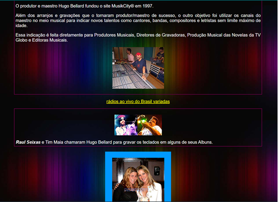
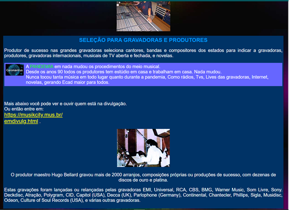
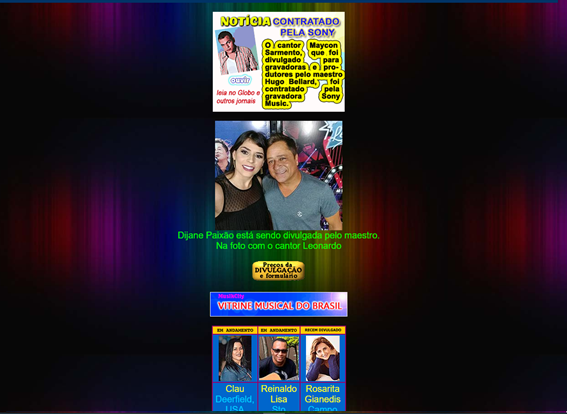
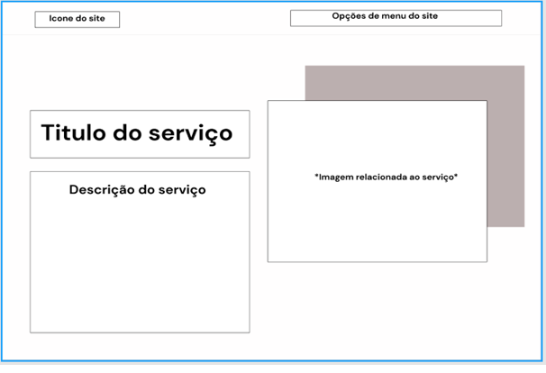
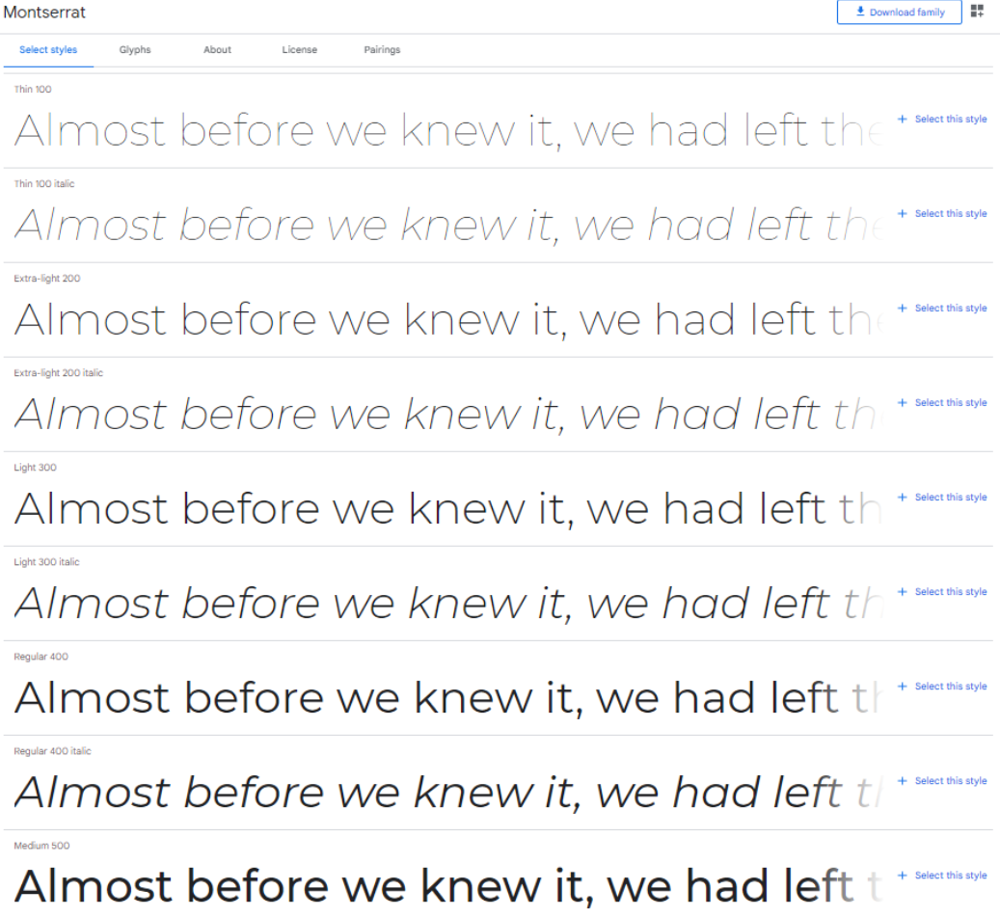
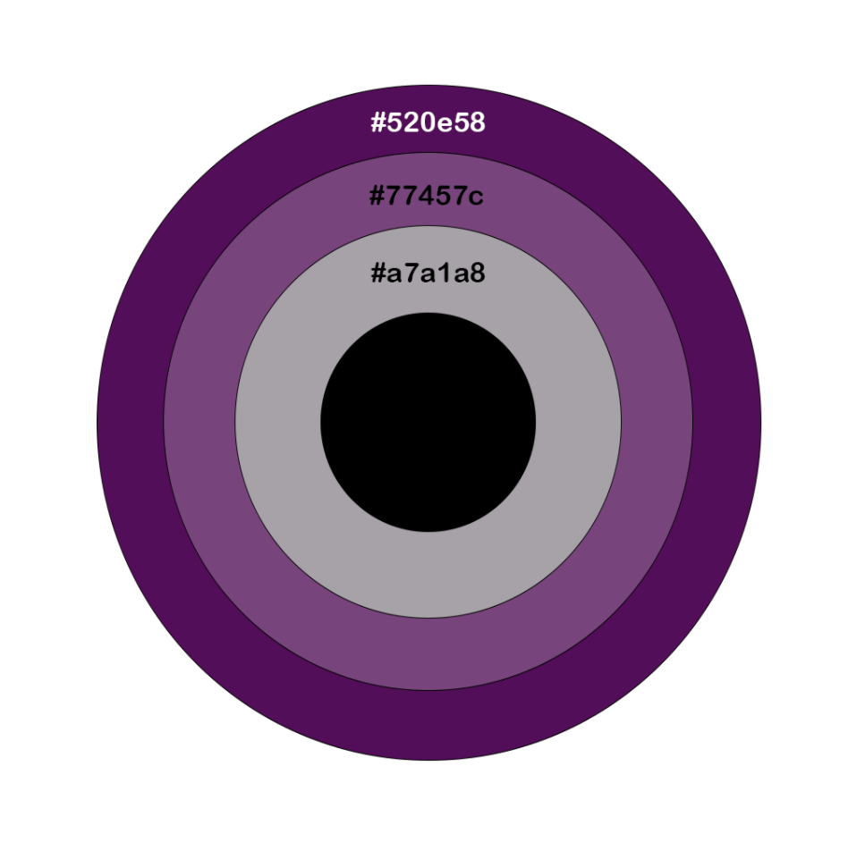
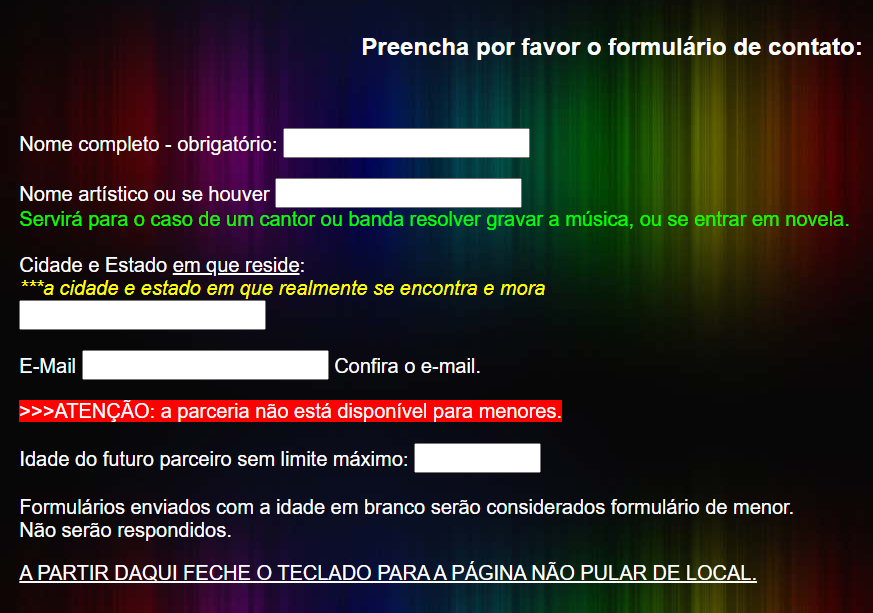
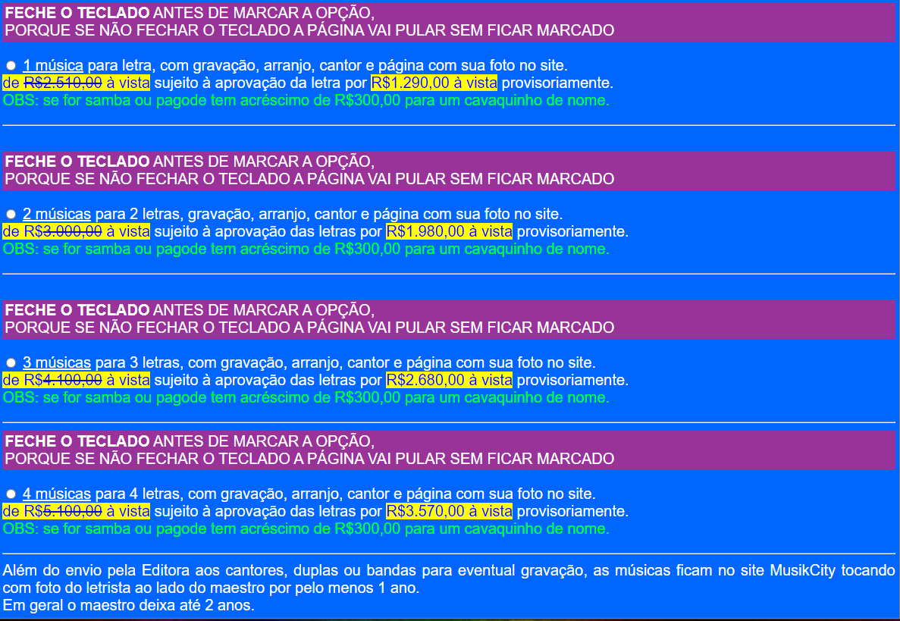
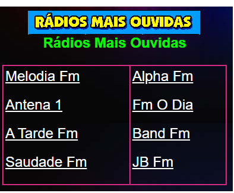

# Guia de Estilo

## Introdução

O objetivo demonstrar os elementos de interfaces, servindo de ponto de partida para garantir um serviço digital consistente, independente do seu alcance, número de páginas ou micro serviços. Guias de estilo servem de ferramenta de comunicação entre os membros da equipe de design e também com a equipe de desenvolvimento.(Barbosa e Silva, 2010).

Sendo assim, o guia de estilo é uma espécie de registro das principais decisões de design tomadas, de forma que elas não se percam, ou seja, sejam efetivamente incorporadas no produto final. O guia de estilo serve como uma ferramenta de comunicação entre os membros da equipe de design com a de desenvolvimento. As decisões podem ser consultadas em qualquer versão futura do produto.

De maneira geral, um Guia de estilo deve incorporar decisões de design envolvendo os principais elementos e considerações de design de interface. Para o Guia de estilo do nosso projeto, será utilizada a estrutura de Marcus, 1992; Mayhew, 1999.

## 1.Introdução Guia de Estilo

### 1.1. Objetivo do guia de estilo

O objetivo desse guia de estilo, como dito anteriormente, é servir como um registro das principais decisões de design tomadas durante a realização do projeto, mas especificamente na realização e constituição dos protótipos.

### 1.2. Organização e conteúdo do guia de estilo

O guia de estilo será organizado conforme a estrutura proposta no livro Interação Humano Computador (BARBOSA, Simone; SILVA, Bruno.) , seguindo a estrutura de Marcus 1992; Mayhew 1999 e terá como conteúdo as principais demandas relacionadas ao design e construção dos nossos protótipos de alta e baixa fidelidade. 

### 1.3. Público-alvo do guia de estilos (programadores, gerentes, equipe de suporte)

O público alvo do nosso guia de estilo será essencialmente a nossa equipe de trabalho, que está em busca de propor uma remodelagem para um site já existente.

### 1.4. Como utilizar o guia (em produção e manutenção)

O guia de estilo será utilizado como um padrão a ser seguido durante a realização e construção dos nossos protótipos, seguindo o design e as informações de estilo que foram preestabelecidas.

### 1.5. Como manter o guia

Para manter o guia de estilo será realizada uma tarefa de aperfeiçoamento continuo durante toda a realização do projeto, de tal modo que a partir do momento que vermos que alguma parte não está mais coerente dentro do nosso escopo ou que precisa ser feita alguma mudança o guia será atualizado e aperfeiçoado. 

## 2. Resultados de análise

### 2.1. Descrição do ambiente de trabalho do usuário

Pelo fato do site possuir várias funcionalidades destinadas a públicos distintos os ambientes de trabalho do usuário podem variar de acordo com o seu objetivo ao utilizar o site. O usuário que está buscando o site para utilizar o recurso de ouvir uma rádio ao-vivo ou para assistir determinado canal de televisão não precisará necessariamente de um ambiente calmo e restrito, ao passo que o usuário que está em busca de algum serviço profissional relacionado ao meio musical necessitará, provavelmente, desse tipo de ambiente.

## 3. Elementos de interface

### 3.1. Disposição espacial e grid

Olhando para o site, de uma maneira geral, é perceptível a falta de organização em relação a disposição espacial. É possível perceber que existe uma disposição espacial em relação aos elementos das páginas, mas essa disposição é totalmente desregrada e não é seguido o mesmo padrão em todas as páginas do site. Além disso os anúncios de serviços do próprio site são dispostos de uma maneira que confunde o usuário durante sua navegação.

<figcaption>Figura 1-Foto destacando a falta de organização </figcaption>

<figcaption>Figura 2-Foto mostrando como a disposição espacial não é seguida em todas as páginas.</figcaption>

<figcaption>Figura 3-Disposição espacial desregulada.</figcaption>

Com base nisso, foi construída uma disposição de layout e grid que poderia ser aplicada ao site:

<figcaption>Figura 4-Disposição espacial desregulada.</figcaption>

### 3.2. Janelas

O site possui algumas janelas informativas. Essas janelas indicam ao usuário possíveis problemas que podem encontrar ou descrevem alguma funcionalidade em específico, como é demonstrado na imagem abaixo. 

### 3.3. Tipografia

A Fonte escolhida foi a Montserrat, que é a família de fonte usada em conteúdos de todo o site.

Figura 5 - Fonte ultilizada

### 3.4. Símbolos não tipográficos

O site não possui símbolos não tipográficos, mas ao analisarmos o design do site percebemos que apesar de serem elementos intuitivos que na maioria das vezes ajudam o usuário a ser guiado pelo site, percebemos que a ausencia de simbolos não tipográficos é uma das características do site e por isso não adicionaremos simbolos não tipográficos ao site, a não ser a logo que direcionará a página inicial.

<figcaption>Figura 6- Icone do site para voltar a página inicial.</figcaption>

### 3.5. Cores

As cores do site serão as descritas abaixo, essas cores deverão ser utilizadas no site para que dessa forma seja mantida a sua consistência.

| Hexadecimal | Uso                                |
| ----------- | ---------------------------------- |
| #520e58     | Navbar, menus e botoes de destaque |
| #77457c     | Ícones                             |
| #a7a1a8     | Detalhes diversos                  |
| #000000     | Fontes                             |

Figura 7 - Cores

## 4. Elementos de interação

### 4.1. Estilos de interação

Atualmente o site utiliza um menu principal de interação que direciona o usuário a todas as abas que ele deseja acessar, no entanto a disposição do menú e a forma como é apresentada as opções muitas vezes pode se tornar confusa, principalmente para novos usuário.

### 4.2. Seleção de um estilo

A disposição do menu deverá ser refeita para o protótipo de alta fidelidade, de maneira que as funcionalidades principais do site sejam destacadas de maneira mais clara no menu. 

## 5. Elementos de ação

### 5.1. Preenchimento de campos

O site possui vários tipo de formulários com objetivos diferentes, seja divulgação musical ou até marcar a gravação de arranjos. A disposição das caixas textuais desses formulários torna difícil a utilização do usuário (algumas são pequenas).

<figcaption>Figura 8 - Imagem de exemplo de formulário.</figcaption>

### 5.2. Seleção

O site possui alguns elementos de seleção que dizer respeito a escolha da opção de pagamento que se encontram também nos formulários. As cores de fundo dificultam a visualização do conteúdo de maneira clara e objetiva.

Além disso é possível encontrar elementos de seleção na funcionalidade para ouvir rádio ao-vivo. São listadas todas as rádios presentes no site e o usuário poderá escolher a que se indifica para poder ouví-la.

<figcaption>Figura 9 - Imagem de exemplo de seleção de pagamento.</figcaption>

<figcaption>Figura 10 - Imagem de exemplo de seleção de rádio.</figcaption>

### 5.3. Ativação

O envio dos formulários acontece com o botão de "enviar" disponível na parte inferior de todos os formulários presentes no site. A ativação da funcionalidade de ouvir rádio acontece por meio do clique no player da rádio.

## 6. Vocabulário e padrões

### 6.1. Terminologia

O vocabulário do site é destinado ao público ao qual a funcionalidade específica é destinado. Por exemplo, para as funcionalidades relacionadas ao profissional da música os termos presentes são mais técnicos e voltados à fechar um contrato profissional. Para as funcionalidades do público em geral (amante da música) os termos utilizados são mais descontráidos e voltados a chamar atenção desse tipo de públicp.

### 6.2. Tipos de tela (para tarefas comuns)

Da meneira como o site foi construído não é possível perceber um padrão de telas. O fundo utilizado em uma tela não é o mesmo fundo utilizado em outras telas. O menú encontrado na maioria das telas não aperece em todas as telas. É altamente recomendado que haja um padrão de telas para não atrapalhar a experiência do usuário e por isso, para o protótipo de alta fidelidade as telas deverão ser reconstruídas com base em um padrão estipulado inicialmente, utilizando-se um padrão de fundo para todas as telas, assim como a disposição do menú e outros elementos da tela.

## 7. Bibliografia

> Barbosa, S. D. J.; Silva, B. S. da; Silveira, M. S.; Gasparini, I.; Darin, T.; Barbosa, G. D. J. (2021) Interação Humano-Computador e Experiência do usuário. Autopublicação.

## 8. Versionamento

| Versão | Data       | Modificação                                                      | Autor          |
| ------ | ---------- | ---------------------------------------------------------------- | -------------- |
| 1.0    | 16/09/2021 | Adição do conteúdo                                               | Mariana Rio    |
| 1.1    | 03/10/2021 | Verificação                                                      | Mariana Rio    |
| 1.2    | 12/10/2021 | Refatoração do conteúdo + adição de tópicos que estavam faltando | Pedro Henrique |
