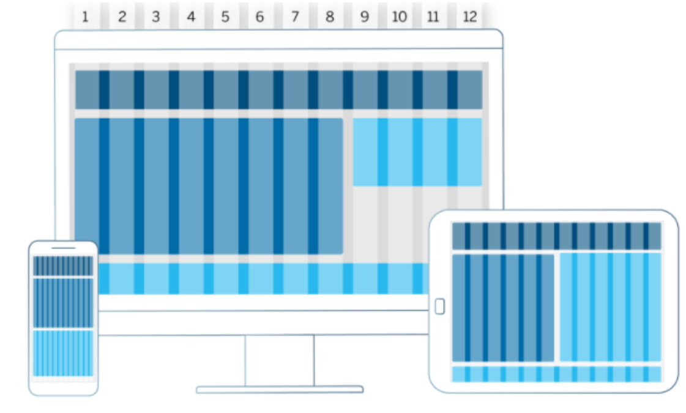

# Guia de Estilo
## 1. Introdução

O objetivo demonstrar os elementos de interfaces, servindo de ponto de partida para garantir um serviço digital consistente, independente do seu alcance, número de páginas ou micro serviços. Guias de estilo servem de ferramenta de comunicação entre os membros da equipe de design e também com a equipe de desenvolvimento.(Barbosa e Silva, 2010).

## 2. Elementos da Interface
### 2.1 Layout e Grid

As grinds vão garantir uma boa organização o de conteudo, enquanto o layout ira garantir um bom comportamento em todos os dispositivos. 

Figura 1 - Grid

### 2.2 Tipografia

A Fonte escolhida foi a Montserrat, que é a família de fonte usada em conteúdos de todo o site.

Figura 2 - Fonte ultilizada

### 2.3 Cores

Seram as cores ultilizadas pelo site para dessa forma mater a sua consistência.

Hexadecimal|Uso       
-----------|----------
#520e58    |Navbar, menus e botoes de destaque
#77457c    |Ícones 
#a7a1a8    |Detalhes diversos
#000000    |Fontes

Figura 3 - Cores

### 2.4 Símbolos não tipográficos

Figura 4 - Ícones

## 3. Bibliografia 

>Barbosa, S. D. J.; Silva, B. S. da; Silveira, M. S.; Gasparini, I.; Darin, T.; Barbosa, G. D. J. (2021) Interação Humano-Computador e Experiência do usuário. Autopublicação.

## 4. Versionamento
Versão|Data      |Modificação        |Autor
------|----------|-------------------|--------
1.0   |16/09/2021|Adição do conteúdo |Mariana Rio
1.1   |03/10/2021|Verificação        |Mariana Rio
