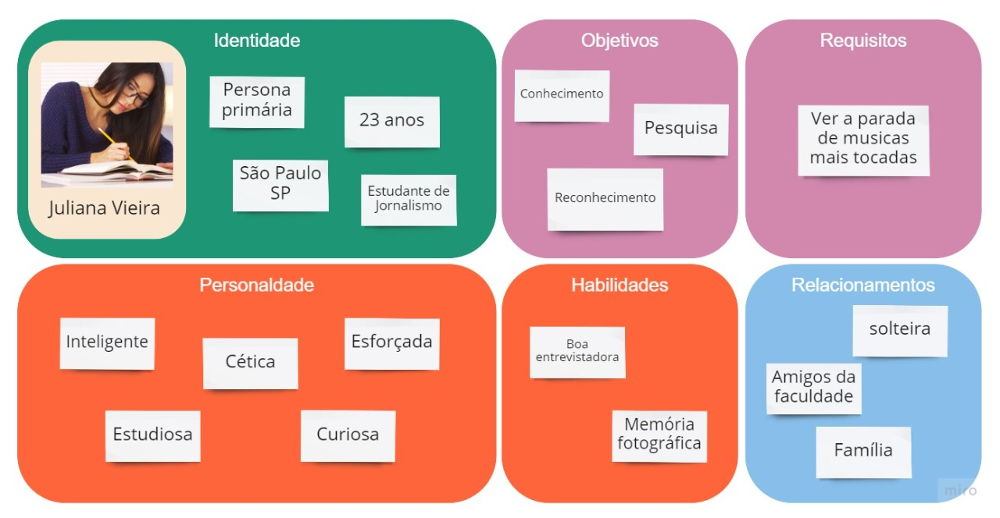
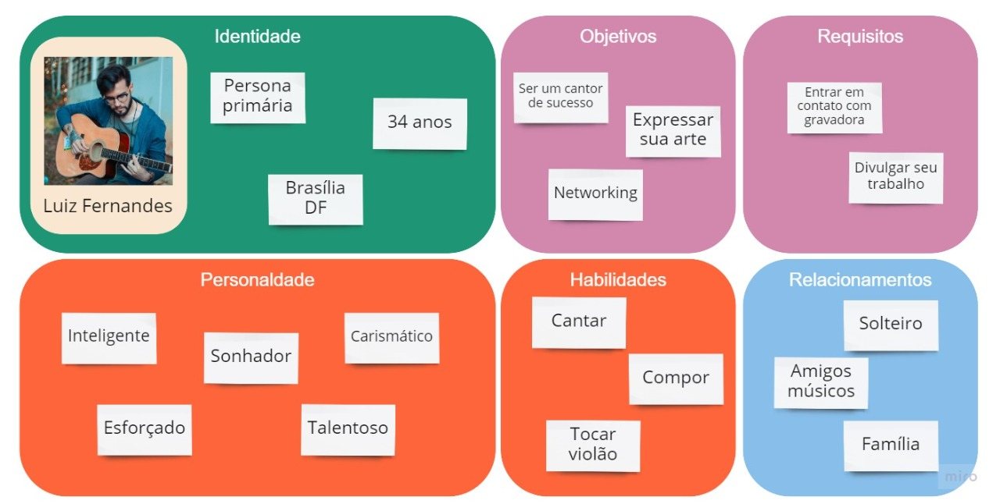
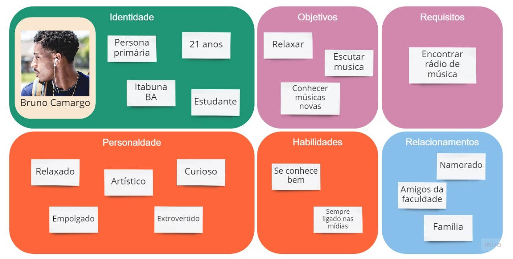

# Personas

Uma persona é um personagem fictício, criado para descrever um usuário típico. E pensando nisso nós definimos algumas delas.

 

## 7. Versionamento
Versão|Data      |Modificação         |Autor
------|----------|--------------------|--------
1.0   |29/08/2021|Criação da wiki     | Eduarda Tavares
1.1   |30/08/2021|Criação do conteúdo | Artur de Sousa
1.2   |30/08/2021|Adição do conteúdo  | Mariana Rio