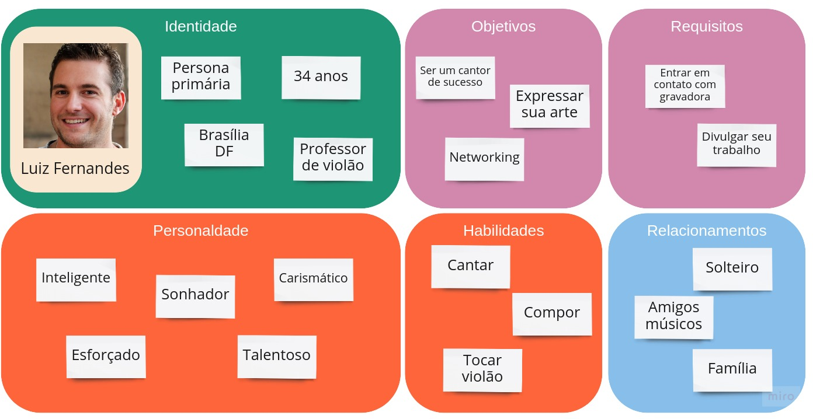
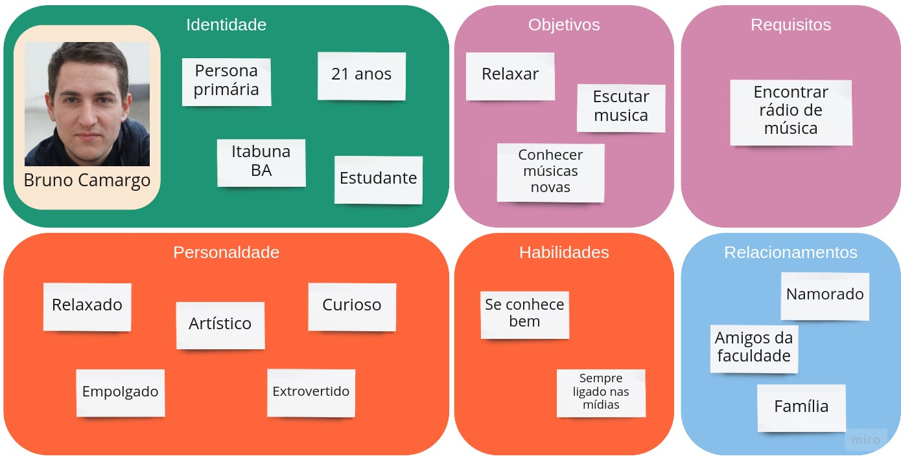
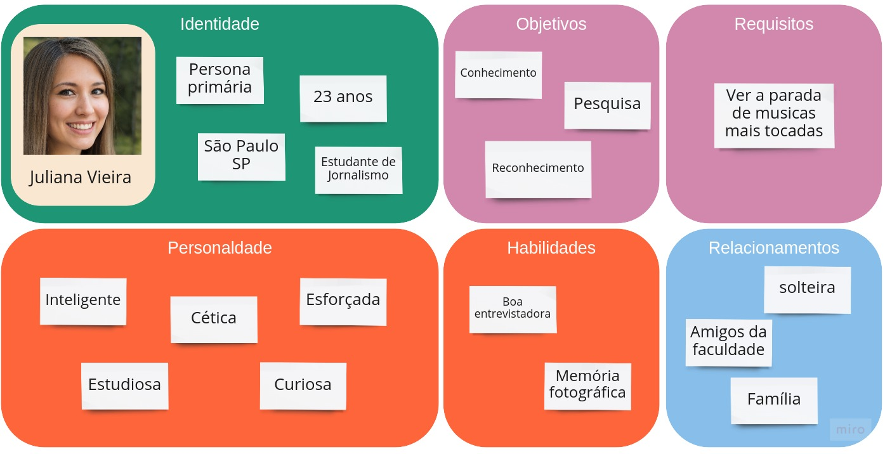
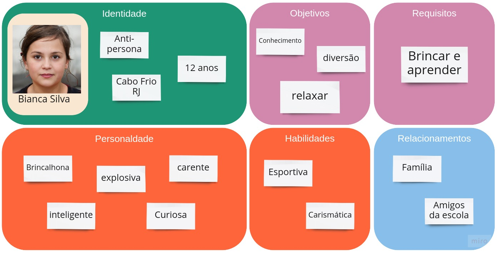

# Personas

## Introdução

Uma persona é um personagem fictício que representa um arquétipo de um grupo de usuários, que tem como objetivo descrever um usuário padrão de um sistema. As personas tem como objetivo principal alinhar os desenvolvedores e os stackholders em qual é o usuário final da aplicação.

Todas as fotos das personas foram tiradas do site <i> This Person Does Not Exist<i\>.

## Personas do Musikcity

Sendo assim, desenvolvemos 3 personas diferentes, sendo elas voltadas em cada uma das tarefas principais que serão o foco do projeto: 

- Escutar rádio;
- Divulgação de artistas;
- Paradas musicais.
 

A primeira persona representa um jovem artista que pretende encontrar um contrato com uma grávadora, procurando o site com o objetido de divulgação.

*Figura 1 -  Persona 1 (Divulgação de artistas), Autoria própria*

A segunda persona representa um jovem que quer escutar musica e descobrir musicas novas,  procurando o site com o objetivo de escutar rádio.

*Figura 2 -  Persona 2 (Escutar rádio), Autoria própria*

A terceira persona representa uma jovem que quer descobrir quais são as músicas mais tocadas pelo brasil,  procurando o site com o objetivo de ver as paradas de sucesso.

*Figura 3 -  Persona 3 (Paradas de sucesso), Autoria própria*

A próxima persona representa uma anti-persona, isto é, uma pessoa que está completamente fora do usuário do site, nesse caso ela se encontra nessa categoria por ser uma criança, a qual o site não é voltado.

*Figura 4 -  Anti-persona, Autoria própria*

## 7. Versionamento
Versão|Data      |Modificação          |Autor
------|----------|---------------------|--------
1.0   |29/08/2021|Criação da wiki      | Eduarda Tavares
1.1   |30/08/2021|Criação do conteúdo  | Artur de Sousa
1.2   |30/08/2021|Adição do conteúdo   | Mariana Rio
1.3   |06/09/2021|Atualização da página| Mariana Rio