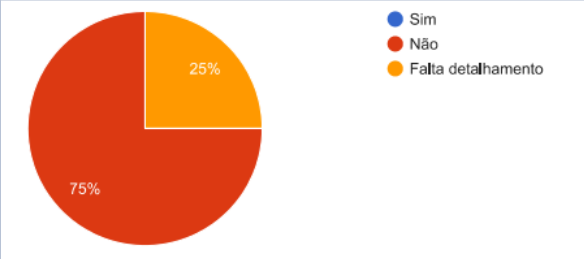
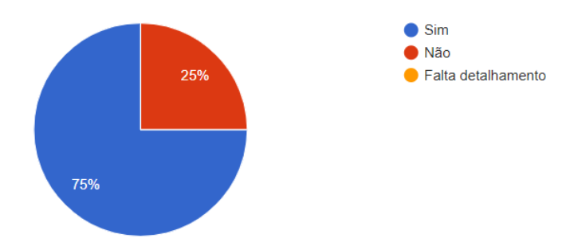
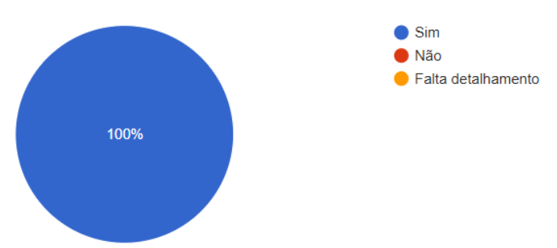

# Resultados do StoryBoard

## 1. Introdução

Como foi discutido no planejamento para a avaliação do nosso storyboard decidimos que o melhor método a ser utilizado seria o questionário. A aplicação desse questionário foi feita para um grupo especifico de pessoas que poderiam ser potenciais usuários do site, ou seja, pessoas que trabalham com o meio musical, que convivem com a musica no seu dia a dia.

## 2. Resultados Obtidos

A primeira pergunta foi relacionada a utilização do site MusikCity e como resposta obtivemos que nenhum dos participantes haviam utilizado o musikcity anteriormente, isso nos dá uma métrica sobre a popularidade da proposta do site nos dias atuais e também sobre a a fidelidade dos nossos resultados.

*Figura 1 -  Resultados obtidos com relação a utilização do site.*

A segunda pergunta foi direcionada especificamente para o nosso storyboard relacionado ao objetivo de entrar em contato com uma gravadora para divulgar seu trabalho. Foi pedido para que os participantes analisassem essa funcionalidade no site e também sua ilustração no storyboard e partir disso foi feita uma pergunta no questionário: "A situação ilustrada no storyboard acima condiz com a realidade?". Como resposta obtivemos que 75% das respostas diziam que o storyboard não condiz com a realidade, 25% responderam que falta detalhamento.

*Figura 2 -  Resultados obtidos com relação ao objetivo de divulgação musical.*

O mesmo foi feito para o storyboard com o objetivo de encontrar novas músicas através de alguma rádio. 75% das pessoas responderam que o storyboard anterior condiz com a realidade e 25% das pessoas responderam que esse storyboard não condiz com a realidade.

*Figura 3 -  Resultados obtidos com relação ao objetivo de encontrar novas músicas através de alguma rádio.*

E por fim o mesmo foi feito com o nosso último storyboard que tem como objetivo descobrir quais as músicas mais tocadas pelo Brasil. Nesse storyboard a resposta recebida foi que 100% dos participantes consideram que a situação ilustrada condiz com a realidade.

*Figura 4 -  Resultados obtidos com relação ao objetivo de descobrir músicas mais tocadas pelo Brasil.*

## 3. Considerações Finais

Com base nas respostas obtidas, foi possível perceber alguns pontos importantes sobre a fidelidade dos nossos storyboards para as situações que foram apontadas no, assim como possíveis apontamentos direcionados ao site.

Foi possível perceber que o site possui baixa adesão até mesmo para as pessoas que trabalham no meio musical, além disso, foi possível perceber, por meio das perguntas discursivas presentes no questionário, que a proposta do site se torna de certo modo enviesada nos dias atuais, pois as pessoas tendem a recorrer a outras plataformas que não necessariamente utilizariam uma gravadora, como foi citado por um dos participantes. 

Em relação aos nossos storyboards foi possível perceber possíveis pontos de mudança, principalmente naqueles que tiveram baixa representatividade em termos de resposta positiva com relação a condizência desses storyboards com a realidade. Os apontamentos feitos pelos participantes serão levados em consideração. 

## 4. Bibliografia

>Barbosa, S. D. J.; Silva, B. S. da; Silveira, M. S.; Gasparini, I.; Darin, T.; Barbosa, G. D. J. (2021) Interação Humano-Computador e Experiência do usuário. Autopublicação.

## 5. Versionamento
Versão|Data      |Modificação        |Autor
------|----------|-------------------|---------------
1.0   |30/09/2021|Criação da pagina  | Pedro Henrique
1.1   |16/10/2021|Adição do conteúdo | Pedro Henrique
1.2   |18/10/2021|Refatoração dos resultados|Pedro Henrique