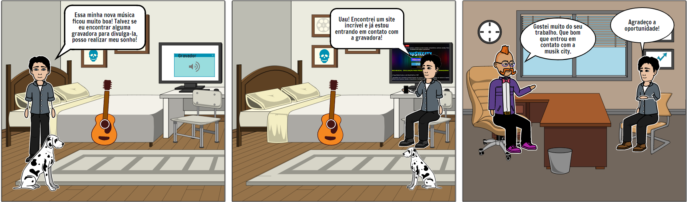
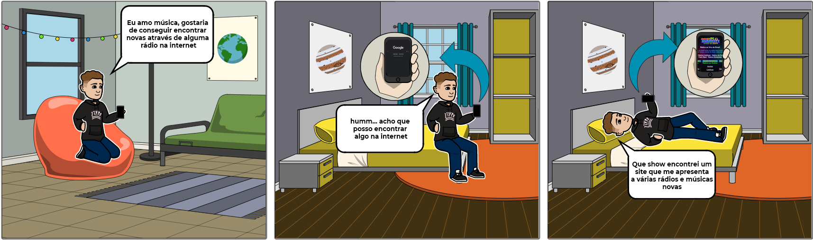
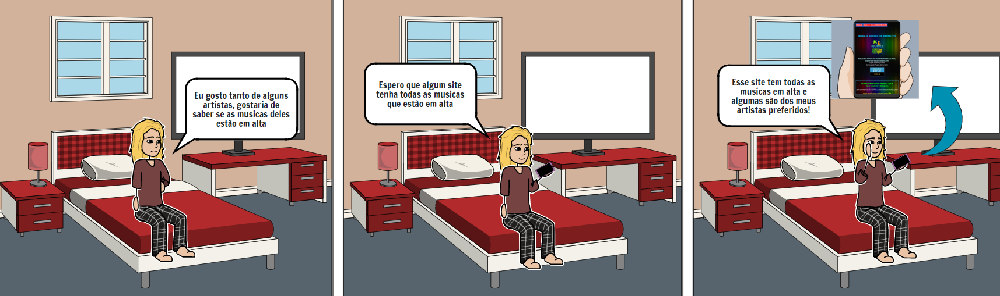

# StoryBoard

## Introdução

Storyboard é um tipo de protótipação de baixa fidelidade, que consiste em uma série de desenhos mostrando como um usuário pode progredir em uma tarefa utilizando o produto que está sendo estudado. Pode-se tratar de uma série de telas esboçadas, ou de uma série de cenas desenhadas mostrando como um usuário pode desempenhar determinada tarefa utilizando um produto. (ROGERS, et al.) 

## Storyboard

Nos Storyboards seguimos o caminho das nossas 3 personas, partindo do seu objetivo em no site MusikCity. 

Objetivo 1: Entrar em contato com uma gravadora para divulgar seu trabalho

Figura 1 - Storyboard persona Luiz Fernandes

Objetivo 2: Encontrar novas músicas novas através de alguma rádio 

Figura 2 - Storyboard persona Bruno Camargo

Objetivo 3: Descobrir quais as musicas mais tocadas pelo Brasil.

Figura 3 - Storyboard persona Juliana Vieira

## Bibliografia
>Barbosa, S. D. J.; Silva, B. S. da; Silveira, M. S.; Gasparini, I.; Darin, T.; Barbosa, G. D. J. (2021) Interação Humano-Computador e Experiência do usuário. Autopublicação. 
>Rogers, Y. Et al. Design de Interação: Além da Interação Humano-Computador. 1ª edição: Bookman.

## Versionamento
Versão|Data      |Modificação        |Autor
------|----------|-------------------|--------
1.0   |16/09/2021|Adição do conteúdo |Mariana Rio
